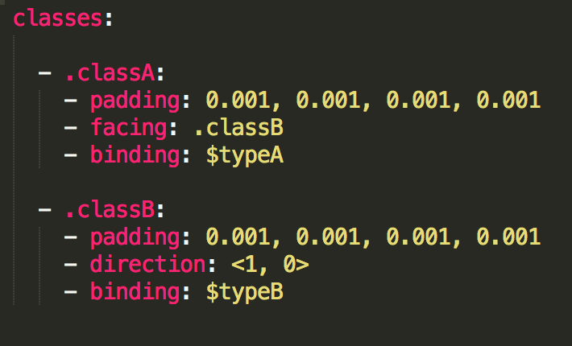

.. ARrange documentation master file, created by
   sphinx-quickstart on Sat Nov 24 20:18:13 2018.
   You can adapt this file completely to your liking, but it should at least
   contain the root `toctree` directive.

Welcome to ARrange's documentation!
===================================

The config file is the main location where you can specify your preferences for your layout preferences. Objects in the layout are separated into classes -- for example, in the config file above, "classA" and "classB." The surfaces in the environment are separated into types, such as "typeA" and "typeB" in the config file above. For this task, we have two types of classes: "person" and "item," and two types of surfaces: "Sittable" and "Placeable." 

Note that a period (".") before a word designates the word as a reference to a class name, and a dollar sign ("$") designates the word as a surface type. The list underneath each class name is a list of constraints that will be applied to each class of objects.

Below is a list of possible constraints you can use for this task. Not all of the constraints have to be used: 

Constraints
===================================
**padding (left, right, top, bottom)**: 
Amount of padding (in meters) you want on each side of the object's bounding box. Example: padding: 0.001, 0.001, 0.001, 0.001

**binding($SurfaceType)**:
Binds the object to the given type of surface. For example, to request for the optimizer to only place objects of classA onto surfaces of typeA, then you would add the following constraint to .classA: "binding: $typeA"

**direction(<x, y>)**: 
Restricts object to face the direction <x, y>. Example: "direction: <1, 0>"

**facing(.class_name)**:
Makes the object face another object of a given class name. For example, to make all objects of classA face objects in classB, you would add the following constraint to .classA: 
"facing: .classB"
        

.. Indices and tables
.. ==================

.. * :ref:`genindex`
.. * :ref:`modindex`
.. * :ref:`search`
